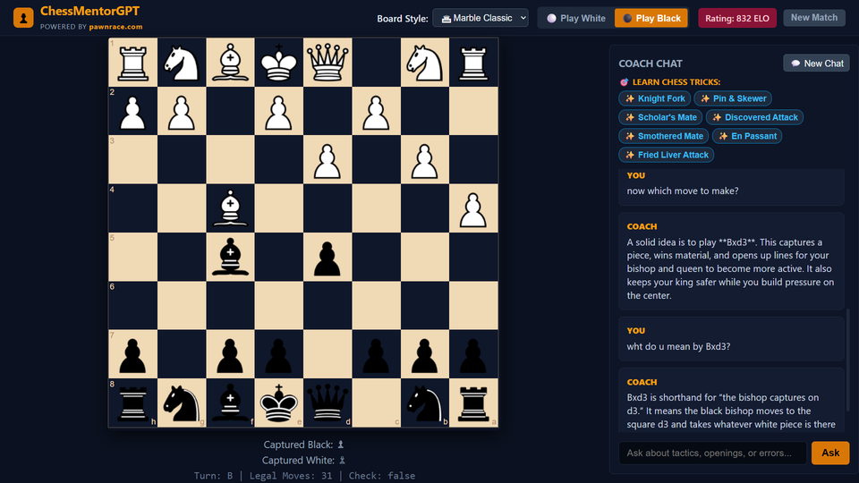

<div align="center">

  <h1>♟️ ChessMentorGPT</h1>
  <p><b>An AI-Powered Grandmaster in Your Browser</b></p>

  <!-- Badges -->
  <a href="https://chess-mentor-gpt.vercel.app/">
    
  </a>
  <a href="https://chessmentorgpt-backend.onrender.com">
    
  </a>
  
  
  

  <br /><br />

  <!-- App Screenshot Showcase -->
  <a href="https://chess-mentor-gpt.vercel.app/">
    
  </a>

  <br />
  <p><i>Click the image above to play live!</i></p>

</div>

---

## 🌟 Overview

**ChessMentorGPT** is a full-stack, real-time chess platform that pairs an interactive chessboard with an instant AI coach. By integrating **Llama 3 via the Groq LPU engine**, players receive grandmaster-level positional feedback, strategic breakdown, and game insights after every single move.

---

## 🔥 Key Features

| Feature | Description |
| :--- | :--- |
| 🧩 **Interactive Board** | Responsive drag-and-drop piece controls powered by `react-chessboard` and `chess.js`. |
| 🤖 **AI Coach Integration** | Real-time tactical analysis and strategy advice driven by Groq's high-speed Llama 3 API. |
| ⚡ **Quick-Prompt Chips** | One-click analysis triggers for opening advice, pawn structure, or endgame evaluation. |
| 📱 **Mobile First Design** | Custom media queries ensuring fluid responsiveness on smartphones, tablets, and desktop screens. |
| ⚡ **Decoupled Architecture** | Microservice structure separating the Vercel frontend from the Render backend. |

---

## 🛠️ Tech Stack & Architecture

```text
 ┌────────────────────────────────┐         ┌────────────────────────────────┐
 │   React (Vite) Frontend        │  HTTP   │   Python / Groq API Backend    │
 │   Hosted on Vercel             ├────────►│   Hosted on Render             │
 │   (chessmentorgpt.vercel.app)  │  POST   │   (chessmentorgpt-backend...)  │
 └────────────────────────────────┘         └────────────────────────────────┘